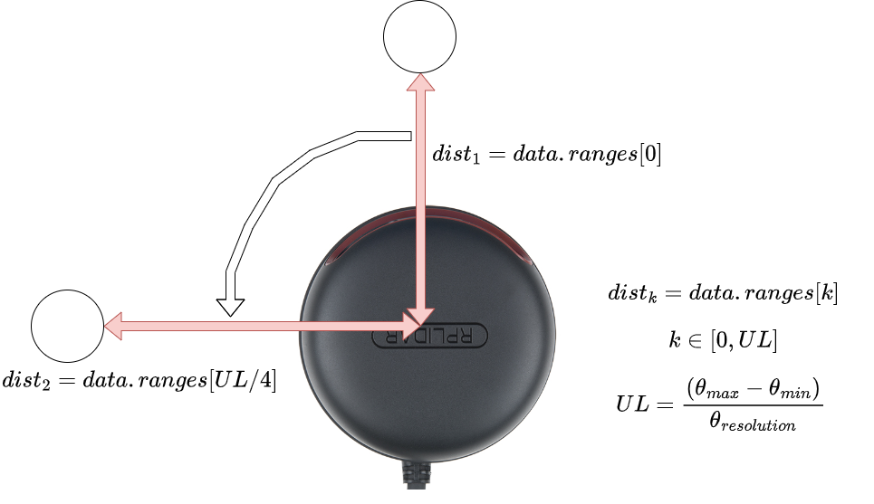
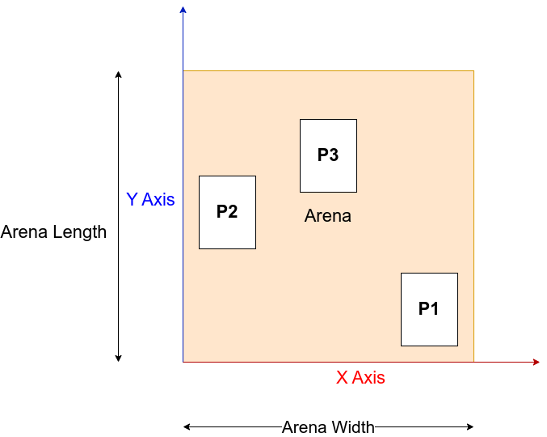

# LiDAR Experiments

# Preparation
1. Install Mobaxterm from [here](https://mobaxterm.mobatek.net/) you can use the portable version.
2. Use the following command to ssh into your raspberry pi
    ```
    ssh -X airl01@192.168.0.168
    ```
    Note: Replace the address with your IP Address

# Localization

The 2D LiDAR sensor can be used to localize the system within an arena. 
The following diagram describes the methods to access range data at a given position:




The following diagram shows the coordinate system to be used for localiztion:



The dimensions of the arena and the code skeleton is available in the file [`rpi_lidar.py`](./rpi_lidar.py)
```
arena_length = 0.97     # in metres
arena_width = 0.58      # in metres
```
# Assignment

## Part 1
You must estimate the position of the lidar in the arena based on the input laser scan data. To work with the recorded data from the robot you must do the following steps:

1. In first terminal run:
```
roscore
```
2. In another terminal run:
```
rosbag play P1.bag
```
Note the `--loop` flag can used to replay the bag in a loop
3. In the third terminal run your program code:
```
python3 rpi_lidar.py
```
4. Create a text file named `localize.txt` with the following format and type in the results for each point (in meters):
```
P1
X 0.10423587
Y 0.44342236
P2
X 0.66345453
Y 0.22123453
P3
X 0.16235454
Y 0.46172934
```
5. To evaluate your code you can run
```
python3 evaluate.py localize.txt 
```

## Part 2
1. Download the rosbag called `experiment.bag`
2. Run your localization algorithm on all the data given in the bag and plot the x and y coordinates as a scatter plot
